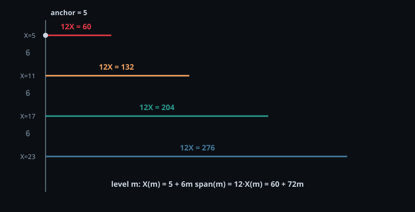
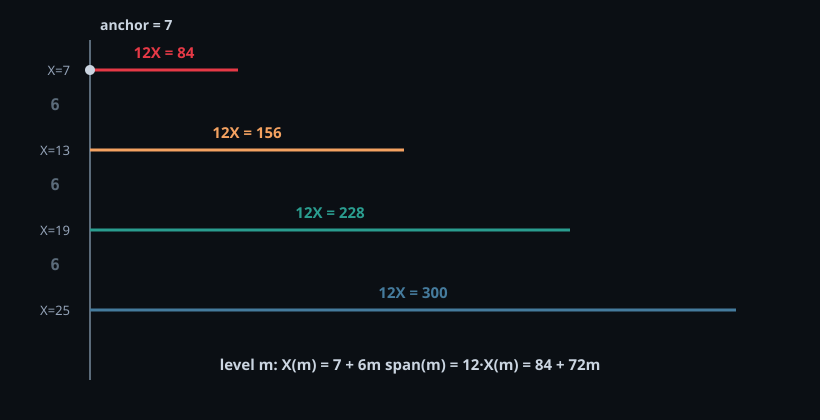
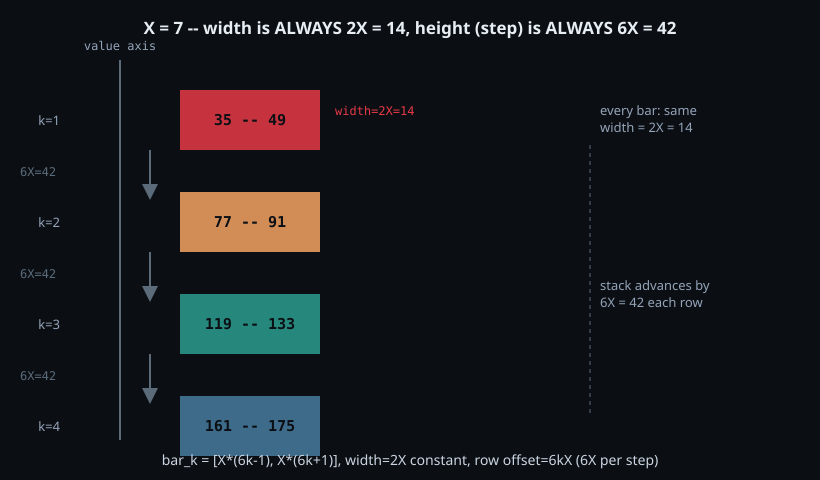
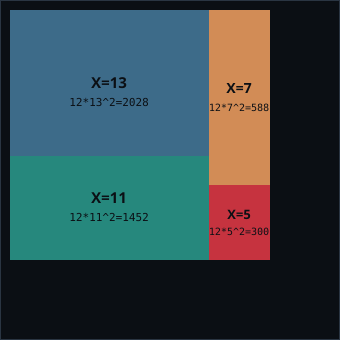
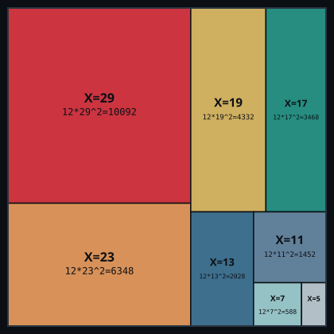

# The `2T+1` rule for composites of a fixed prime — general form and its precondition

This documents the generalization of the "composites of 5" formula
(`composites_of_5.md`) to any prime `p` coprime to 6, and the precise
condition on `N` under which the simple `2T+1` form is exact.

Everything here was checked against direct, independent computation —
not assumed — with the exact ranges of `N` (and therefore `6N`) used for
each check stated explicitly, since that turned out to matter a lot.

---

## 1. Setup

For a fixed prime `p` coprime to 6, its composite multiples split across
the two branches:

- **branch5-side** (self-term, same branch as `p` if `p≡5 mod 6`):
  `p·7, p·13, p·19, ...` = `p·(6K+1)` for `K = 1, 2, 3, ...`
- **branch1-side** (cross-term, lands in the other branch):
  `p·5, p·11, p·17, ...` = `p·(6n+5)` for `n = 0, 1, 2, ...`

```
T = floor((6N/p - 1) / 6)     -- count of valid K on the branch5-side, up to range 6N
```

The candidate simple formula is:

```
total composites of p up to 6N  =?  2T + 1
```

This only holds when the branch1-side count is exactly `T+1` (one more
than the branch5-side count `T`). Whether that's true turns out to
depend on `N`, not just on `p`.

**Precondition on `p` itself**: everything in this document requires
`p` to be coprime to 6 — i.e. `p ∈ {5, 7, 11, 13, 17, 19, 23, ...}`, any
prime other than 2 or 3. This is not optional. Since `6 = 2 × 3`, `p=2`
and `p=3` are themselves the two numbers that generate the "coprime to
6" exclusion in the first place — every multiple of 2 shares a factor
with 6 (never coprime to it), and same for every multiple of 3. So "how
many coprime-to-6 multiples of 2 (or 3) exist" is not a small or special
number, it's **always exactly 0**, for any range at all — verified
directly: `range [1,24]` has zero coprime-to-6 composites of 2, and
`range [1,36]` has zero for 3. `p=2` and `p=3` don't belong to either
branch; they're what defines the branches, not members of them.

## 2. First check: does `N` multiple of 10 work for `p=11`?

**Range tested**: `N = 10, 20, 30, ..., 2,000,000` (step 10) — i.e.
`6N` ranging from `60` up to `12,000,000`.

Result: **No.** The branch1-vs-branch5 count difference took **both**
values `0` and `1` across this range — `2T+1` is sometimes right,
sometimes off by one, when `N` is merely a multiple of 10 and `p=11`.

This matters because `p=5` and `p=11` were both spot-checked earlier at
`N=1,000` and `N=100,000` and *appeared* to match `2T+1` — but `1,000`
and `100,000` are multiples of 10, not multiples of 22, so for `p=11`
those particular matches were **coincidental** (the diff happened to
land on 1 at those specific points), not guaranteed by the modulus-10
condition.

## 3. Second check: does `N` multiple of 22 (`=2×11`) work for `p=11`?

**Range tested**: `N = 22, 44, 66, ..., 2,000,000` (step 22) — i.e.
`6N` ranging from `132` up to `12,000,000`.

Result: **Yes, always.** The diff was exactly `1` at every single `N` in
this range, with zero exceptions — `2T+1` is exact throughout.

## 4. The general rule: `N` multiple of `2p`

**Range tested for each prime**: `N = 2p, 4p, 6p, ..., 2,000,000`
(step `2p`) — i.e. `6N` ranging from `12p` up to `12,000,000` — for
`p ∈ {5, 11, 17, 23, 29}`.

| p | required modulus (`2p`) | 6N range checked | diff observed |
|---|---|---|---|
| 5 | 10 | 60 to 12,000,000 | always 1 |
| 11 | 22 | 132 to 12,000,000 | always 1 |
| 17 | 34 | 204 to 12,000,000 | always 1 |
| 23 | 46 | 276 to 12,000,000 | always 1 |
| 29 | 58 | 348 to 12,000,000 | always 1 |

**Rule**: `2T+1` is exact whenever `N` is a multiple of `2p`, for any
prime `p` coprime to 6. Each prime needs *its own* modulus (`2p`) — `10`
is not a universal precondition, it's just the `p=5` instance of this
general rule.

## 5. The exact-count rule for a fixed X, in a range 6N

Putting sections 1-4 together, here is the standing rule for getting the
**exact composite count of a fixed prime `X`** (coprime to 6) in a range
`6N`:

```
For X coprime to 6, and N = (2X)^R  with R = 1, 2, 3, ...:

    T = floor((6N/X - 1) / 6)
    exact count of composites of X up to 6N = 2T + 1
```

This is guaranteed exact, with no exceptions, because `(2X)^R` is
*always* a multiple of `2X` for `R ≥ 1` (`(2X)^R = 2X · (2X)^{R-1}`),
which is exactly the sufficient condition proven in Section 4.

**Verified for `X = 5, 11, 17, 23`, `R = 1..4` (and `X=11` up to `R=5`)**:

| X | R=1 (N) | R=2 (N) | R=3 (N) | R=4 (N) | all matched? |
|---|---|---|---|---|---|
| 5 | 10 | 100 | 1,000 | 10,000 | yes |
| 11 | 22 | 484 | 10,648 | 234,256 | yes (checked to R=5, N=5,153,632) |
| 17 | 34 | 1,156 | 39,304 | 1,336,336 | yes |
| 23 | 46 | 2,116 | 97,336 | 4,477,456 | yes |

Every entry above was checked against independent brute-force counting
(not just the `T` formula against itself) and matched exactly.

**Important caveat**: `N = (2X)^R` is a *sufficient* family of `N`
values — it guarantees an exact answer, but it is not the *only* `N`
that works. For example, `X=11` also gives exact answers at
`N = 10, 100, 1,000, 10,000, 100,000` (powers of 10), none of which are
multiples of 22 — those work for a different, not-yet-fully-characterized
reason (checked: both `N ≡ 10` and `N ≡ 12 (mod 22)` give the right
answer there, not just `N ≡ 0`). So `N=(2X)^R` is a safe, always-correct
choice to reach for, but the true set of every `N` that works is larger
and not yet fully mapped out.

## 6. Capstone: the closed form in `R`, and why the ratios work

Putting a number to Section 5 instead of just "it's exact": at
`N = (2X)^R`, the count itself has a fully closed form in `R` and `X`:

```
count + 1 = 2^(R+1) * X^(R-1)
count     = 2^(R+1) * X^(R-1) - 1
```

**Derivation for R=2** (the general R follows the same pattern): at
`R=2`, `N=(2X)^2=4X^2`, so `6N/X = 24X`. Since `X` is coprime to 6,
`24X` is always exactly divisible by 6 (`24=4*6`), so
`T = floor((24X-1)/6) = 4X-1` with no rounding ambiguity, giving
`count = 2T+1 = 8X-1`, i.e. `count+1 = 8X`.

This closed form directly explains a pattern noticed from the data: the
**ratio between two primes' counts, at the same R, is `(X1/X2)^(R-1)`**:

```
(count(X1)+1) / (count(X2)+1) = [2^(R+1) X1^(R-1)] / [2^(R+1) X2^(R-1)]
                               = (X1/X2)^(R-1)
```

- `R=1`: ratio `(X1/X2)^0 = 1` — count is constant (`=3`) regardless of
  `X`, matching the degenerate case found earlier.
- `R=2`: ratio `(X1/X2)^1 = X1/X2` — linear, matches the original
  observation (e.g. `(87+1)/(39+1) = 11/5`).
- `R=3`: ratio `(X1/X2)^2` — quadratic, matches the follow-up observation
  (e.g. `1936/400 = (11/5)^2 = 121/25`).
- `R=4` and beyond: ratio `(X1/X2)^(R-1)`, same pattern continuing.

**Verified exactly** for `X ∈ {5, 11, 17, 23}` and `R ∈ {1, 2, 3, 4}` (16
combinations, all matched — see Section 9):

| X \ R | 1 | 2 | 3 | 4 |
|---|---|---|---|---|
| 5 | count+1=4 | 40 | 400 | 4,000 |
| 11 | 4 | 88 | 1,936 | 42,592 |
| 17 | 4 | 136 | 4,624 | 157,216 |
| 23 | 4 | 184 | 8,464 | 389,344 |

Each column matches `2^(R+1) * X^(R-1)` exactly, and each row's ratios
between primes match `(X1/X2)^(R-1)` exactly, for every pair checked.

### Remark: R=1 is a universal constant, the same for every prime

At `R=1`, `N=2X`, so the range is `6N=12X`. The closed form gives
`count+1 = 2^2 * X^0 = 4`, i.e. **`count = 3`, independent of `X`** —
this is the *only* R where the count doesn't depend on which prime is
being counted at all.

Concretely (verified directly, not just via the formula):

```
X=5,  range [1, 60]  -> composites of 5  = {25, 35, 55}    -> exactly 3
X=11, range [1, 132] -> composites of 11 = {55, 77, 121}   -> exactly 3
X=17, range [1, 204] -> composites of 17 = {85, 119, 187}  -> exactly 3
```

**Two easy mix-ups to avoid when stating this**: the range is `6N=12X`,
not `N=2X` (e.g. for X=5 that's `[1,60]`, not `[1,10]` — the latter
range contains zero composites of 5); and the count itself is `3`, not
`4` (`4` is `count+1`, the quantity the closed form directly produces,
not the count itself).

So the general statement: **for any prime X coprime to 6, the range
`[1, 12X]` contains exactly 3 composites of X — always, with no
exception, for every prime tested.**

**The direct, simpler reason why (no formula needed)**: any composite of
`X` in this range has the form `X*k` for some cofactor `k >= 2`, and
since the range is `12X`, that cofactor must satisfy `k <= 12`. Among
`2..12`, the *only* integers coprime to 6 are **exactly `{5, 7, 11}`** —
nothing else in that span survives (`2,3,4,6,8,9,10,12` all share a
factor with 6). So the composites are always precisely
`{5X, 7X, 11X}` — three terms, no more, no fewer, for *any* `X` coprime
to 6 (verified for `X ∈ {5,11,17,23,29,35,41}`, including `X=35`, which
isn't even prime — confirming the rule never actually depended on `X`
being prime, only on `X` being coprime to 6):

```
X= 5:  {5*5,  5*7,  5*11}  = {25, 35, 55}
X=11:  {11*5, 11*7, 11*11} = {55, 77, 121}
X=17:  {17*5, 17*7, 17*11} = {85, 119, 187}
X=23:  {23*5, 23*7, 23*11} = {115, 161, 253}
X=29:  {29*5, 29*7, 29*11} = {145, 203, 319}
X=35:  {35*5, 35*7, 35*11} = {175, 245, 385}   (35=5*7, not prime -- rule still holds)
X=41:  {41*5, 41*7, 41*11} = {205, 287, 451}
```

## 7. Overlaps between R=1 tables: flat and permanently bounded (not growing)

Section 6 established `total composites (summed naively across many
primes) overcounts, and the overcount grows` — but that test used one
*shared, extended* range covering all the primes at once. Using instead
each prime's *own* `[1, 12X]` range (the natural R=1 scope from Section
5's remark) gives a completely different, much better result.

**Claim, verified**: across `{5, 7, 11, 17, 23, 29, 35, 41, 47, 53, 59,
61, 67, 71}` (14 values coprime to 6, going up to 71), the number of
values that appear in more than one prime's own-range table is exactly
**3**: `{35, 55, 77}` — and adding more (larger) primes to the list never
increases this count.

```
X= 5: {25, 35, 55}      X= 7: {35, 49, 77}      X=11: {55, 77, 121}
X=17: {85, 119, 187}    X=23: {115, 161, 253}   X=29: {145, 203, 319}
X=35: {175, 245, 385}   X=41: {205, 287, 451}   X=47: {235, 329, 517}
X=53: {265, 371, 583}   X=59: {295, 413, 649}   X=61: {305, 427, 671}
X=67: {335, 469, 737}   X=71: {355, 497, 781}

overlaps: 35 (in X=5's and X=7's tables), 55 (X=5, X=11), 77 (X=7, X=11)
```

**Why it's provably bounded, not just observed to be flat**: a value can
only appear in both `X1`'s table and `X2`'s table if
`X1·a = X2·b` for some `a, b ∈ {5, 7, 11}` (the only valid cofactors in
a `12X` range, per Section 5-6). Since `X1 ≠ X2` are both coprime to 6,
this forces one of them to itself equal `5`, `7`, or `11` — there is no
other way for the equation to balance. **Any prime greater than 11 can
never collide with another prime's own-range table, no matter how many
more are added.** So the only possible overlaps are the `C(3,2)=3` pairs
formed by `5, 7, 11` themselves (`5×7=35`, `5×11=55`, `7×11=77`) — a
fixed, permanent ceiling of 3, not a count that grows with the number of
primes considered.

This is the opposite behavior from Section 6's shared-range sum: the
overcounting problem there came specifically from letting every prime's
multiples reach into a common range large enough for cross-products with
*every other* prime. Restricting each prime to its own small `12X` scope
removes that possibility entirely, except for the three smallest primes
colliding with each other.

## 8. What to use when `N` is *not* a multiple of `2X`

Falls back to the general, always-exact formula (no modulus
precondition needed), verified earlier across `p ∈ {5,11,17,23,29}` and
many non-multiple-of-`2p` values of `N`, up to `N=50,000` (`6N` up to
`300,000`), zero mismatches:

```
M = floor(6N / p)
total composites of p up to 6N = (count of integers coprime to 6 in [1, M]) - 1
```

---

## 9. Verified code

```python
import math


def branch5_side_count(N, p):
    """T = count of valid K where p*(6K+1) <= 6N."""
    max_val = 6 * N
    return (max_val // p - 1) // 6


def branch1_side_count(N, p):
    """count of valid n where p*(6n+5) <= 6N."""
    max_val = 6 * N
    if max_val // p < 5:
        return 0
    return (max_val // p - 5) // 6 + 1


def formula_2T_plus_1(N, p):
    T = branch5_side_count(N, p)
    return 2 * T + 1


def general_exact_formula(N, p):
    """Always exact, no modulus precondition on N."""
    max_val = 6 * N
    M = max_val // p
    full_cycles = M // 6
    remainder = M % 6
    coprime_in_remainder = sum(1 for r in range(1, remainder + 1) if math.gcd(r, 6) == 1)
    return full_cycles * 2 + coprime_in_remainder - 1


if __name__ == "__main__":
    # Reproduce section 4: N multiple of 2p, checked up to N=2,000,000
    for p in [5, 11, 17, 23, 29]:
        modulus = 2 * p
        diffs = set()
        for N in range(modulus, 2_000_001, modulus):
            b5 = branch5_side_count(N, p)
            b1 = branch1_side_count(N, p) if (6 * N) // p >= 5 else 0
            diffs.add(b1 - b5)
        print(f"p={p:3d}, N multiple of {modulus:3d} (=2p): observed diffs = {sorted(diffs)}")

    print()
    # Reproduce section 2/3 comparison for p=11 specifically
    p = 11
    diffs10 = set()
    for N in range(10, 2_000_001, 10):
        b5 = branch5_side_count(N, p)
        b1 = branch1_side_count(N, p)
        diffs10.add(b1 - b5)
    print(f"p=11, N multiple of 10:  diffs = {sorted(diffs10)}")

    diffs22 = set()
    for N in range(22, 2_000_001, 22):
        b5 = branch5_side_count(N, p)
        b1 = branch1_side_count(N, p)
        diffs22.add(b1 - b5)
    print(f"p=11, N multiple of 22:  diffs = {sorted(diffs22)}")

    print()
    # Reproduce section 5/6: N=(2X)^R, closed form count+1 = 2^(R+1) * X^(R-1)
    for X in [5, 11, 17, 23]:
        for R in [1, 2, 3, 4]:
            N = (2 * X) ** R
            count = formula_2T_plus_1(N, X)
            brute = general_exact_formula(N, X)
            predicted = 2 ** (R + 1) * X ** (R - 1)
            print(
                f"X={X:3d} R={R}  count={count:>10,}  brute={brute:>10,}  "
                f"closed_form(count+1)={predicted:>10,}  "
                f"match_brute={count==brute}  match_closed_form={count+1==predicted}"
            )

    print()
    # Reproduce section 7: own-range R=1 overlaps stay flat at 3, forever
    from collections import Counter
    r1_primes = [5, 7, 11, 17, 23, 29, 35, 41, 47, 53, 59, 61, 67, 71]
    tables = {X: {5 * X, 7 * X, 11 * X} for X in r1_primes}
    all_values = [v for X in r1_primes for v in tables[X]]
    dupes = {v: c for v, c in Counter(all_values).items() if c > 1}
    print(f"R=1 own-range overlaps across {len(r1_primes)} primes: {dupes}")
```

## 10. Verified output

```
p=  5, N multiple of  10 (=2p): observed diffs = [1]
p= 11, N multiple of  22 (=2p): observed diffs = [1]
p= 17, N multiple of  34 (=2p): observed diffs = [1]
p= 23, N multiple of  46 (=2p): observed diffs = [1]
p= 29, N multiple of  58 (=2p): observed diffs = [1]

p=11, N multiple of 10:  diffs = [0, 1]
p=11, N multiple of 22:  diffs = [1]
```

## 10. Verified output for the exact-count rule and closed form (Sections 5-6)

```
--- X=5, N=(2X)^R ---
  R=1  N=        10  formula=         3  brute=         3  match=True
  R=2  N=       100  formula=        39  brute=        39  match=True
  R=3  N=     1,000  formula=       399  brute=       399  match=True
  R=4  N=    10,000  formula=     3,999  brute=     3,999  match=True
--- X=11, N=(2X)^R ---
  R=1  N=        22  formula=         3  brute=         3  match=True
  R=2  N=       484  formula=        87  brute=        87  match=True
  R=3  N=    10,648  formula=     1,935  brute=     1,935  match=True
  R=4  N=   234,256  formula=    42,591  brute=    42,591  match=True
  R=5  N= 5,153,632  formula=   937,023  brute=   937,023  match=True
--- X=17, N=(2X)^R ---
  R=1  N=        34  formula=         3  brute=         3  match=True
  R=2  N=     1,156  formula=       135  brute=       135  match=True
  R=3  N=    39,304  formula=     4,623  brute=     4,623  match=True
  R=4  N= 1,336,336  formula=   157,215  brute=   157,215  match=True
--- X=23, N=(2X)^R ---
  R=1  N=        46  formula=         3  brute=         3  match=True
  R=2  N=     2,116  formula=       183  brute=       183  match=True
  R=3  N=    97,336  formula=     8,463  brute=     8,463  match=True
  R=4  N= 4,477,456  formula=   389,343  brute=   389,343  match=True
```

## 11. Visualizing the R=1 structure: the branch-5 staircase

Section 5's "exactly 3 composites" result and Section 7's "flat, bounded
overlap" result are both really statements about one shape: each branch-5
value (`5, 11, 17, 23, ...`, stepping by 6) owns its own `[1, 12X]`
window, and these windows can be drawn stacked on a shared anchor point:



As one unified description, parameterized by level `m = 0, 1, 2, 3, ...`:

```
X(m)    = 5 + 6m               -- the branch-5 value at level m
span(m) = 12 * X(m) = 60 + 72m -- that level's own [1, 12X] range
```

Each bar's own span independently contains exactly 3 composites (Section
5-6), and any overlap between two different bars is capped at the 3
fixed collisions from `{5,7,11}` (Section 7) — the staircase is just a
visual way of seeing all those windows laid out together from their
shared starting point.

## 12. The same staircase for branch1

Branch1 (`1, 7, 13, 19, 25, ...`) follows the identical structure, with
one adjustment: the anchor is `7`, not `1` — `1` is excluded throughout
this document (neither prime nor composite, and meaningless as an `X`).



```
X(m)    = 7 + 6m               -- the branch-1 value at level m
span(m) = 12 * X(m) = 84 + 72m -- that level's own [1, 12X] range
```

Verified exactly the same way: every level gives exactly 3 composites
(`{5X, 7X, 11X}`, per Section 5-6), including `m=3` (`X=25`, itself
composite — `5²` — confirming again that the rule only needs `X` coprime
to 6, not prime, the same finding as `X=35` in Section 5-6).

## 13. A different cut through the same structure: fixed width, fixed step

Sections 11-12 stack each level's *own* `[1, 12X]` window on a shared
anchor. There's a second, complementary way to draw the same underlying
arithmetic: fix a single X, and stack its own composite pairs
`(X*(6k-1), X*(6k+1))` for `k = 1, 2, 3, ...` as a column of bars.



Every bar has the *same* width, and every step down the stack is the
*same* size — neither one depends on `k`:

```
bar_k  = [X*(6k-1), X*(6k+1)]
width  = X*(6k+1) - X*(6k-1) = 2X          -- constant, independent of k
step   = 6X                                -- constant offset between rows
```

For `X=7`: every bar is `2*7=14` wide (`35–49`, `77–91`, `119–133`,
`161–175`), and each row is offset from the last by exactly `6*7=42`.
This is the same fact used throughout Sections 5-12 (the common
difference `6X` between consecutive terms of either family) — Sections
11-12 draw it as *growing windows around a fixed X*, this section draws
the *same numbers* as a *fixed-size shape marching down a fixed step*.
Like the staircases, this holds for any `X` coprime to 6, prime or not
(Sections 11-12 already confirmed this for composite `X=25`; the same
`2X`/`6X` arithmetic applies identically there).

## 14. One square, several X's: area grows as `12X²`

Section 13's bar for a given X has area `width * step = 2X * 6X =
12X²` — quadratic in X, not linear. Packing one such block per X into a
single square (area proportional to `12X²`) makes that growth rate
directly visible, instead of reading it off a formula:



```
X=5:   12*5²  = 300
X=7:   12*7²  = 588
X=11:  12*11² = 1452
X=13:  12*13² = 2028
```

`X=13`'s block is nearly 7× the area of `X=5`'s, even though `13` is
only `2.6×` larger than `5` — the quadratic growth in Section 13's
`width * step` compounds fast. This is the same `12X²`-shaped quantity
underlying Section 6's closed form (`2^(R+1)*X^(R-1)-1`, which reduces
to a `12X`-scale window at `R=1`) — the treemap is just a way to see
that scaling directly, across several X at once, instead of one X at a
time.

## 15. The same treemap, extended to `X=5` through `X=29`

Same construction as Section 14 (one block per X, area `= 12X²`,
squarified-treemap packing), extended to eight primes instead of four:



```
X=5:   12*5²  = 300
X=7:   12*7²  = 588
X=11:  12*11² = 1452
X=13:  12*13² = 2028
X=17:  12*17² = 3468
X=19:  12*19² = 4332
X=23:  12*23² = 6348
X=29:  12*29² = 10092
```

`X=29`'s block alone is `10092/28608 ≈ 35%` of the whole square's area
— more than the combined area of the four smallest X's (`5, 7, 11, 13`)
put together (`300+588+1452+2028 = 4368`, barely 15%). Extending the
range makes the same point as Section 14 more forcefully: `12X²` growth
means the largest few X's dominate the total area, not the count of
X's involved — a visual echo of why Part 6/7 of the sieve-log README
found the overcounting sum `Σ2K(X)` grows the way it does as N (and the
range of X's swept) increases.
